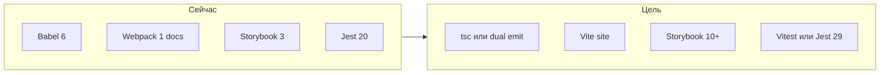

# План: модернизация форка react-color + подготовка для агентов

## Текущее состояние (кратко)

- Сборка пакета уже переведена на **`tsc`** с пофайловым ESM-выводом в `es/`, см. [`package.json`](package.json) и [`tsconfig.es.json`](tsconfig.es.json).
- Тестовый стек уже обновлён до **Vitest + Testing Library + jsdom**, линтинг работает через **ESLint flat config**, а сайт документации и Storybook переведены на современный пайплайн.
- Код библиотеки, истории Storybook и тестовые файлы под [`src/`](src/) уже переведены на актуальные TypeScript-совместимые расширения.
- Публичный barrel уже синхронизирован с текущим публичным API: default export и именованные экспорты идут из [`src/index.ts`](src/index.ts).

---

## Фаза 0 — Подготовка под агентов (приоритет)

Цель: чтобы любой агент (Cursor и др.) сразу видел контекст, границы задач и соглашения.

1. **[AGENTS.md](AGENTS.md)** в корне (кратко и по делу):
   - Назначение репозитория (форк, цели: TS, современные deps, чистка legacy).
   - Карта каталогов: `src/` — исходники библиотеки; `site/` — актуальная документация; `.storybook/` — сторибук.
   - Команды (после миграции обновить): тесты, линт, сборка пакета, сторибук, доки.
   - **Публичный API**: перечислить экспорты из [`src/index.ts`](src/index.ts) и правило «не ломать имена экспортов без major и CHANGELOG».
   - Ограничения: peer `react`/`react-dom`, стиль стилизации (сейчас `reactcss` + inline — не менять весь подход в одном PR).

2. **`.cursor/rules/`** — несколько узких правил (формат `.mdc` с frontmatter), по рекомендациям Cursor: одна тема — один файл, **&lt; ~50 строк** где возможно:
   - `alwaysApply: true` — общий контекст проекта (форк, цель миграции, не трогать `es/` руками, только через сборку).
   - `globs: src/**/*.{ts,tsx}` — стандарты TypeScript (strict поэтапно, типы для публичных пропсов, `types` в package.json).
   - опционально `globs: **/*.spec.*` — тесты (переход на Testing Library вместо Enzyme).

3. **Дополнительно по желанию** (не блокер): `.editorconfig`, краткий раздел в README про разработку форка, шаблон PR/checklist для «breaking vs non-breaking».

Итог фазы: агенты не гадают, где граница «библиотека vs примеры», и какие экспорты священны для пользователей npm.

---

## Фаза 1 — Минимальные исправления и базовая гигиена

- [x] Исправить barrel entrypoint-а (исторически [`src/index.js`](src/index.js), теперь [`src/index.ts`](src/index.ts)): отдельные `export { default as ChromePicker }` и `export { default }` из `./components/chrome/Chrome`.
- [x] Зафиксировать решения в [`AGENTS.md`](AGENTS.md) и кратко в [`README.md`](README.md):
  - **Минимальная версия React (цель модернизации):** 16.8+; peer в `package.json` — в фазе 4.
  - **Имя пакета:** переименован в `react-color-x`; смена scope/имени зафиксирована как breaking change в CHANGELOG.

---

## Фаза 2 — Современный toolchain (до или параллельно с TS)

**Ограничение:** избегать лишних breaking changes в структуре публикации пакета без осознанного решения и записи в CHANGELOG; изменения `main` / `module` / `files`, deep imports и формата сборочных артефактов рассматривать отдельно.

| Область   | Направление                                                                                                                                                                                                                                                                                                                    |
| --------- | ------------------------------------------------------------------------------------------------------------------------------------------------------------------------------------------------------------------------------------------------------------------------------------------------------------------------------ |
| Сборка    | Приоритет: **`tsc`** с пофайловым выходом как у Babel. Исторически фаза начиналась с dual emit, текущий контракт — ESM-only в `es/`. **tsdown** — только если подтверждён режим без единого бандла на весь пакет и сохраняется дерево путей. **tsup** не использовать (не поддерживается; **tsdown** — преемник в экосистеме). |
| Типы      | `typescript`, в [`package.json`](package.json) добавить поле **`types`**; поле **`exports`** — опционально и вводится только после отдельной оценки влияния на резолверы и deep imports.                                                                                                                                       |
| Линт      | ESLint **flat config** + `@typescript-eslint` + `eslint-plugin-react-hooks`; удалить зависимость от `@case/eslint-config`, если она не поддерживается.                                                                                                                                                                         |
| Тесты     | **Vitest** + **jsdom** + **@testing-library/react** (замена Enzyme 2 / старых утилит); тестовые файлы уже живут на TS-совместимых расширениях.                                                                                                                                                                                 |
| Storybook | Обновить до **10.x** (или актуальной LTS), переписать [`.storybook/config.js`](.storybook/config.js) под новый формат; истории уже переведены на `story.tsx`. После миграции вернуть `reactDocgen`, если он был временно отключён из-за legacy Babel-конфига.                                                                  |
| Доки      | Legacy `docs/` был заменён Vite-сайтом в [`site/`](site/); актуальные команды: `site:dev`, `site:build`, `site:verify`.                                                                                                                                                                                                        |

Статус: фаза по сути завершена. Дальше остаются только follow-up задачи по legacy dependencies и cleanup, а не незавершённый toolchain-блок.

---

## Фаза 3 — Миграция на TypeScript

- Включить **`allowJs`** на первом шаге (опционально **`checkJs`**) или сразу переименовывать файлы блоками: сначала [`src/helpers/`](src/helpers/), общие типы цвета (`tinycolor2`, HSV/RGB), затем [`src/components/common/`](src/components/common/), затем отдельные pickers.
- Типизация пропсов: заменить/дополнить **PropTypes** типами TS для публичных компонентов; runtime PropTypes можно убрать после стабилизации типов (уменьшит размер бандла).
- **Строгость**: начать с умеренного `strict` или `strict: false` + включение `strictNullChecks`/`noImplicitAny` поэтапно — иначе единый огромный PR.
- Зависимости: `@types/react`, `@types/react-dom`, типы для `tinycolor2` (или обёртка), по необходимости типизация `reactcss` (локальные `.d.ts` если пакет без типов).

Статус: основная цель фазы завершена. Helper-ы, common-компоненты, `ColorWrap`, picker-ы, entrypoints, истории и тесты уже на актуальных TS-совместимых расширениях, сборка и тесты зелёные.

---

## Фаза 4 — Обновление зависимостей и «legacy»

Статус: основная цель фазы завершена.

- **React**: `peerDependencies.react` зафиксирован на `>=16.8.0`; корневые `devDependencies.react` / `react-dom` остаются на современном major для сайта документации и Storybook.
- **Примеры**: старые standalone example-приложения из `examples/` удалены; актуальные демонстрации и developer docs живут в [`site/`](site/) и Storybook.
- **lodash / lodash-es**: зафиксирована промежуточная стратегия без лишнего рефакторинга: path-imports в исходниках и post-build rewrite импортов на `lodash-es` для ESM-сборки.
- **Cleanup**: прямые legacy `devDependencies`, старые standalone examples и legacy docs toolchain убраны из корня репозитория.
- **CI**: GitHub Actions workflow в [`.github/workflows/ci.yml`](.github/workflows/ci.yml) использует матрицу Node `20.x` / `24.x` и обязательные шаги `npm test`, `npm run test:visual`, `npm run build`, `npm run test:public-types`, `npm run build-storybook`, `npm run typecheck`, `npm run site:verify`, `npm run ci:artifacts`, `npm pack --dry-run`.
- **Post-phase-3 follow-up**: `noImplicitAny` и `strictNullChecks` уже включены, permissive API для `Color` / `styles` / callback-аргументов сохранён, post-migration хвосты по `lodash`-утилитам и helper-типам дочищены, а совместимые DX-изменения и migration notes синхронизированы в [`CHANGELOG.md`](CHANGELOG.md) и [`README.md`](README.md).

Проверено локально `2026-03-20`: `npm test` и `npm run build` проходят на текущем состоянии репозитория.

---

## Фаза 5 — Миграция `docs/` на TypeScript

Статус: завершена как отдельный follow-up после основной модернизации `src`, toolchain и legacy cleanup.

Примечание: legacy-приложение `docs/` удалено после появления актуального сайта в [`site/`](site/).

- Цель фазы была выполнена до удаления legacy docs: runtime-код документационного сайта был переведён на TypeScript без непреднамеренных изменений публичного API пакета.
- После удаления `docs/` отдельные legacy-команды документационного приложения и docs-specific typecheck больше не являются актуальной частью workflow.
- Текущий documentation workflow: `npm run site:dev`, `npm run site:build`, `npm run site:verify`.

---

## Фаза 6 — Follow-up по открытым issues апстрима

Статус: завершена как отдельная волна runtime/DX follow-up после модернизационных фаз 2–5.

- Цель фазы: закрыть наиболее ценные открытые боли upstream `casesandberg/react-color`, которые всё ещё могут быть актуальны для форка, без ненужных поломок публичного API пакета.
- Реализованы и зафиксированы: CSP-safe градиенты, удаление `defaultProps` warnings, локализация runtime-иконок, iframe-safe drag behavior в `Saturation` и текущая ESM-only consumption-проверка.
- Публичный контракт текущей ветки ESM-only: сохраняются root `index.d.ts`, пофайловые `es/`, documented ESM deep imports и текущие имена экспортов из [`src/index.ts`](src/index.ts).
- В scope фазы входили только non-breaking runtime и DX-улучшения; `exports` map, смена packaging contract, redesign theming/styling-системы и отдельный accessibility rewrite оставлены вне этой волны.

Проверки и notes синхронизированы в [`README.md`](README.md) и [`package.json`](package.json), включая `npm run test:esm-consumption`.

---

## Фаза 7 — Styling modernization после завершения core modernization

Статус: предложена как следующая отдельная волна после фаз 2–6.

- Цель фазы: убрать `reactcss` и текущую систему inline-default styles, перевести пикеры и общие примитивы на co-located SCSS и глобальные BEM-классы без ненужной ломки публичного API.
- Стили каждого компонента должны храниться рядом с самим компонентом, а не в одном общем каталоге компонентных стилей.
- Публикация CSS должна поддерживать выборочный импорт только нужных пикеров или общих примитивов. Общий aggregate entry допустим только как optional convenience-path, а не как обязательный контракт.
- Публичная кастомизация должна опираться на `className`, новый `classNames`, CSS custom properties и `theme`, при этом текущий `styles` остаётся как deprecated compatibility layer на переходный период.
- Темная тема входит в scope фазы и реализуется через root BEM-модификаторы и CSS variables, без завязки на CSS Modules.

---

## Риски и порядок работ

- **Большой взрывной PR** нежелателен: лучше «зелёный main» после фазы 0–1, затем toolchain, затем TS по папкам с сохранением тестов на поведение.
- **Стили**: массовая замена `reactcss` вынесена в отдельную фазу 7; базовое направление зафиксировано как global BEM + co-located SCSS + granular CSS imports, а не CSS Modules.

---

## Рекомендуемый порядок веток/итераций

1. AGENTS.md + `.cursor/rules` + фикс entrypoint-а (исторически [`src/index.js`](src/index.js), теперь [`src/index.ts`](src/index.ts)).
2. Новый сборщик + `tsconfig` + первый компилируемый пакет с `.d.ts`.
3. Тестовый стек (Vitest + Testing Library) и миграция одного модуля как эталон.
4. Постепенная конвертация `src/**/*.js` → `.ts`/`.tsx`.
5. Storybook и docs на современном bundler.
   На Storybook держать отдельный хвост: если для совместимости временно отключён `reactDocgen`, включить его обратно после удаления legacy Babel 6-конфига.
6. Follow-up после phase 5: дальнейшие ужесточения сверх `strictNullChecks` и любые новые несовместимости документировать отдельными маленькими шагами.
7. Product/runtime follow-up после завершения модернизации: закрыть наиболее ценные открытые issues апстрима по CSP, `defaultProps`, runtime icons, iframe-safe drag behavior и interop.
8. Styling follow-up после завершения core/runtime modernization: убрать `reactcss`, перевести пикеры на co-located SCSS и BEM-классы, добавить dark theme и granular CSS imports.

---

## Чеклист задач (дорожная карта)

- [x] Добавить AGENTS.md и `.cursor/rules/*.mdc` (контекст форка, структура, API, соглашения)
- [x] Исправить невалидный экспорт в entrypoint-е пакета (Chrome default + ChromePicker)
- [x] Заменить Babel 6 на пофайловую ESM-сборку через `tsc`; обновить package.json (`types`, `exports`)
- [x] Ввести Vitest/Jest 29 + Testing Library + ESLint flat + typescript-eslint
- [x] Поэтапно перевести `src` на `.ts`/`.tsx`, типы публичного API, d.ts в публикации
- [x] Обновить Storybook и пайплайн docs (убрать Webpack 1); после удаления legacy Babel вернуть `reactDocgen`, если он был временно отключён
- [x] Обновить peer deps, почистить devDependencies, примеры, CI
- [x] Усилить TS-строгость и закрыть follow-up cleanup legacy docs/dev tooling; migration notes синхронизированы в `CHANGELOG.md` и `README.md`
- [x] Заменить legacy `docs/` workflow актуальным сайтом в `site/`; текущие проверки документации идут через `npm run site:verify`
- [x] Закрыть следующую волну upstream/runtime follow-up задач без breaking changes: CSP-safe градиенты, удаление `defaultProps`, локальные runtime-иконки, iframe-safe `Saturation` и проверка ESM/CJS interop
- [ ] Убрать `reactcss` и перевести styling-систему на co-located SCSS, BEM-классы, dark theme и granular CSS imports
