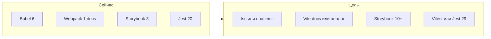

# План: модернизация форка react-color + подготовка для агентов

## Текущее состояние (кратко)

- Библиотека на **ES5/React-классах**, сборка через **Babel 6** ([`.babelrc`](.babelrc)) в `lib/` (CJS) и `es/` (ESM), см. [`package.json`](package.json).
- Доки на **Webpack 1** ([`webpack.config.js`](webpack.config.js)), Storybook **3.x**, Jest **20** + Enzyme **2**, React **15** в devDependencies.
- Barrel [`src/index.js`](src/index.js) **исправлен в фазе 1:** отдельные `export { default as ChromePicker }` и `export { default }` из [`Chrome.js`](src/components/chrome/Chrome.js) (через `ColorWrap`).

---

## Фаза 0 — Подготовка под агентов (приоритет)

Цель: чтобы любой агент (Cursor и др.) сразу видел контекст, границы задач и соглашения.

1. **[AGENTS.md](AGENTS.md)** в корне (кратко и по делу):
   - Назначение репозитория (форк, цели: TS, современные deps, чистка legacy).
   - Карта каталогов: `src/` — исходники библиотеки; `examples/` — примеры; `docs/` — сайт; `.storybook/` — сторибук.
   - Команды (после миграции обновить): тесты, линт, сборка пакета, сторибук, доки.
   - **Публичный API**: перечислить экспорты из [`src/index.js`](src/index.js) и правило «не ломать имена экспортов без major и CHANGELOG».
   - Ограничения: peer `react`/`react-dom`, стиль стилизации (сейчас `reactcss` + inline — не менять весь подход в одном PR).

2. **`.cursor/rules/`** — несколько узких правил (формат `.mdc` с frontmatter), по рекомендациям Cursor: одна тема — один файл, **&lt; ~50 строк** где возможно:
   - `alwaysApply: true` — общий контекст проекта (форк, цель миграции, не трогать `lib/`/`es/` руками, только через сборку).
   - `globs: src/**/*.{ts,tsx}` — стандарты TypeScript (strict поэтапно, типы для публичных пропсов, `types` в package.json).
   - опционально `globs: **/*.spec.*` — тесты (переход на Testing Library вместо Enzyme).

3. **Дополнительно по желанию** (не блокер): `.editorconfig`, краткий раздел в README про разработку форка, шаблон PR/checklist для «breaking vs non-breaking».

Итог фазы: агенты не гадают, где граница «библиотека vs примеры», и какие экспорты священны для пользователей npm.

---

## Фаза 1 — Минимальные исправления и базовая гигиена

- [x] Исправить barrel в [`src/index.js`](src/index.js): отдельные `export { default as ChromePicker }` и `export { default }` из `./components/chrome/Chrome`.
- [x] Зафиксировать решения в [`AGENTS.md`](AGENTS.md) и кратко в [`README.md`](README.md):
  - **Минимальная версия React (цель модернизации):** 16.8+; peer в `package.json` — в фазе 4.
  - **Имя пакета:** пока `react-color`; смена scope/имени — только с major и CHANGELOG.

---

## Фаза 2 — Современный toolchain (до или параллельно с TS)

**Ограничение:** по возможности сохранить **drop-in замену** апстриму `react-color` — те же `main`/`module`/`files`, **пофайловый** вывод в `lib/` и `es/` (как у Babel), без перехода на «один бандл вместо дерева» без осознанного breaking-релиза.

| Область | Направление |
|--------|-------------|
| Сборка | Приоритет: **`tsc`** (два `tsconfig` для CJS/ESM), пофайловый выход как у Babel. **tsdown** — только если подтверждён режим без единого бандла на весь пакет и сохраняется дерево путей. **tsup** не использовать (не поддерживается; **tsdown** — преемник в экосистеме). Цель — убрать Babel 6 и ручные скрипты [`scripts/use-module-babelrc.js`](scripts/use-module-babelrc.js) / [`restore-original-babelrc.js`](scripts/restore-original-babelrc.js). |
| Типы | `typescript`, в [`package.json`](package.json) добавить поле **`types`**; поле **`exports`** — опционально и только если не ломает drop-in (старые резолверы / deep-imports). |
| Линт | ESLint **flat config** + `@typescript-eslint` + `eslint-plugin-react-hooks`; удалить зависимость от `@case/eslint-config`, если она не поддерживается. |
| Тесты | **Vitest** + **jsdom** + **@testing-library/react** (замена Enzyme 2 / старых утилит); перенести `spec.js` → `*.spec.tsx` по мере миграции. |
| Storybook | Обновить до **10.x** (или актуальной LTS), переписать [`.storybook/config.js`](.storybook/config.js) под новый формат; истории из `story.js` — постепенно. |
| Доки | Заменить Webpack 1 на **Vite** (или аналог) для dev-сервера документации; пересмотреть [`scripts/docs-server.js`](scripts/docs-server.js) / [`docs-dist`](scripts/docs-dist.js). |

---

## Фаза 3 — Миграция на TypeScript

- Включить **`allowJs`** на первом шаге (опционально **`checkJs`**) или сразу переименовывать файлы блоками: сначала [`src/helpers/`](src/helpers/), общие типы цвета (`tinycolor2`, HSV/RGB), затем [`src/components/common/`](src/components/common/), затем отдельные pickers.
- Типизация пропсов: заменить/дополнить **PropTypes** типами TS для публичных компонентов; runtime PropTypes можно убрать после стабилизации типов (уменьшит размер бандла).
- **Строгость**: начать с умеренного `strict` или `strict: false` + включение `strictNullChecks`/`noImplicitAny` поэтапно — иначе единый огромный PR.
- Зависимости: `@types/react`, `@types/react-dom`, типы для `tinycolor2` (или обёртка), по необходимости типизация `reactcss` (локальные `.d.ts` если пакет без типов).

---

## Фаза 4 — Обновление зависимостей и «legacy»

- **React**: поднять peer и dev до выбранного минимума; обновить примеры в [`examples/`](examples/).
- **lodash / lodash-es**: сузить до нужных функций или заменить на лёгкие утилиты (меньше поверхность для CVE и размер).
- **Удалить мёртвые/странные devDependencies** (например `npm` как devDependency, дубли тест-раннеров), почистить неиспользуемые скрипты после миграции сборки.
- **CI**: добавить GitHub Actions (lint + test + build) если ещё нет — зафиксировать как обязательный шаг после появления зелёной сборки.

---

## Риски и порядок работ

- **Большой взрывной PR** нежелателен: лучше «зелёный main» после фазы 0–1, затем toolchain, затем TS по папкам с сохранением тестов на поведение.
- **Стили**: массовая замена `reactcss` на CSS-modules — отдельное решение (можно отложить после TS и тестов).

---

## Рекомендуемый порядок веток/итераций

1. AGENTS.md + `.cursor/rules` + фикс [`src/index.js`](src/index.js).
2. Новый сборщик + `tsconfig` + первый компилируемый пакет с `.d.ts`.
3. Тестовый стек (Vitest + Testing Library) и миграция одного модуля как эталон.
4. Постепенная конвертация `src/**/*.js` → `.ts`/`.tsx`.
5. Storybook и docs на современном bundler.
6. Чистка legacy, жёсткий ESLint/TS, документация breaking changes.

---

## Чеклист задач (дорожная карта)

- [x] Добавить AGENTS.md и `.cursor/rules/*.mdc` (контекст форка, структура, API, соглашения)
- [x] Исправить невалидный экспорт в `src/index.js` (Chrome default + ChromePicker)
- [x] Заменить Babel 6 на пофайловую сборку через `tsc` (два `tsconfig` для `lib/` и `es/`); обновить package.json (`types`; `exports` — опционально для drop-in)
- [ ] Ввести Vitest/Jest 29 + Testing Library + ESLint flat + typescript-eslint
- [ ] Поэтапно перевести `src` на `.ts`/`.tsx`, типы публичного API, d.ts в публикации
- [ ] Обновить Storybook и пайплайн docs (убрать Webpack 1)
- [ ] Обновить peer deps, почистить devDependencies, примеры, CI
