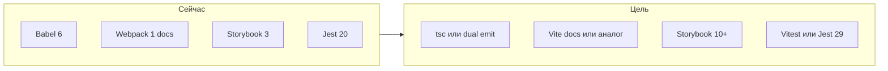

# План: модернизация форка react-color + подготовка для агентов

## Текущее состояние (кратко)

- Сборка пакета уже переведена на **`tsc`** с пофайловым выводом в `lib/` (CJS) и `es/` (ESM), см. [`package.json`](package.json), [`tsconfig.lib.json`](tsconfig.lib.json), [`tsconfig.es.json`](tsconfig.es.json).
- Тестовый стек уже обновлён до **Vitest + Testing Library + jsdom**, линтинг работает через **ESLint flat config**, а docs и Storybook переведены на современный пайплайн.
- Код библиотеки, истории Storybook и тестовые файлы под [`src/`](src/) уже переведены на актуальные TypeScript-совместимые расширения.
- Публичный barrel уже синхронизирован с drop-in API: default export и именованные экспорты идут из [`src/index.ts`](src/index.ts).

---

## Фаза 0 — Подготовка под агентов (приоритет)

Цель: чтобы любой агент (Cursor и др.) сразу видел контекст, границы задач и соглашения.

1. **[AGENTS.md](AGENTS.md)** в корне (кратко и по делу):
   - Назначение репозитория (форк, цели: TS, современные deps, чистка legacy).
   - Карта каталогов: `src/` — исходники библиотеки; `examples/` — примеры; `docs/` — сайт; `.storybook/` — сторибук.
   - Команды (после миграции обновить): тесты, линт, сборка пакета, сторибук, доки.
   - **Публичный API**: перечислить экспорты из [`src/index.ts`](src/index.ts) и правило «не ломать имена экспортов без major и CHANGELOG».
   - Ограничения: peer `react`/`react-dom`, стиль стилизации (сейчас `reactcss` + inline — не менять весь подход в одном PR).

2. **`.cursor/rules/`** — несколько узких правил (формат `.mdc` с frontmatter), по рекомендациям Cursor: одна тема — один файл, **&lt; ~50 строк** где возможно:
   - `alwaysApply: true` — общий контекст проекта (форк, цель миграции, не трогать `lib/`/`es/` руками, только через сборку).
   - `globs: src/**/*.{ts,tsx}` — стандарты TypeScript (strict поэтапно, типы для публичных пропсов, `types` в package.json).
   - опционально `globs: **/*.spec.*` — тесты (переход на Testing Library вместо Enzyme).

3. **Дополнительно по желанию** (не блокер): `.editorconfig`, краткий раздел в README про разработку форка, шаблон PR/checklist для «breaking vs non-breaking».

Итог фазы: агенты не гадают, где граница «библиотека vs примеры», и какие экспорты священны для пользователей npm.

---

## Фаза 1 — Минимальные исправления и базовая гигиена

- [x] Исправить barrel entrypoint-а (исторически [`src/index.js`](src/index.js), теперь [`src/index.ts`](src/index.ts)): отдельные `export { default as ChromePicker }` и `export { default }` из `./components/chrome/Chrome`.
- [x] Зафиксировать решения в [`AGENTS.md`](AGENTS.md) и кратко в [`README.md`](README.md):
  - **Минимальная версия React (цель модернизации):** 16.8+; peer в `package.json` — в фазе 4.
  - **Имя пакета:** пока `react-color`; смена scope/имени — только с major и CHANGELOG.

---

## Фаза 2 — Современный toolchain (до или параллельно с TS)

**Ограничение:** по возможности сохранить **drop-in замену** апстриму `react-color` — те же `main`/`module`/`files`, **пофайловый** вывод в `lib/` и `es/` (как у Babel), без перехода на «один бандл вместо дерева» без осознанного breaking-релиза.

| Область   | Направление                                                                                                                                                                                                                                                                                                                                                                                                                                                |
| --------- | ---------------------------------------------------------------------------------------------------------------------------------------------------------------------------------------------------------------------------------------------------------------------------------------------------------------------------------------------------------------------------------------------------------------------------------------------------------- |
| Сборка    | Приоритет: **`tsc`** (два `tsconfig` для CJS/ESM), пофайловый выход как у Babel. **tsdown** — только если подтверждён режим без единого бандла на весь пакет и сохраняется дерево путей. **tsup** не использовать (не поддерживается; **tsdown** — преемник в экосистеме). Цель — убрать Babel 6 и ручные скрипты [`scripts/use-module-babelrc.js`](scripts/use-module-babelrc.js) / [`restore-original-babelrc.js`](scripts/restore-original-babelrc.js). |
| Типы      | `typescript`, в [`package.json`](package.json) добавить поле **`types`**; поле **`exports`** — опционально и только если не ломает drop-in (старые резолверы / deep-imports).                                                                                                                                                                                                                                                                              |
| Линт      | ESLint **flat config** + `@typescript-eslint` + `eslint-plugin-react-hooks`; удалить зависимость от `@case/eslint-config`, если она не поддерживается.                                                                                                                                                                                                                                                                                                     |
| Тесты     | **Vitest** + **jsdom** + **@testing-library/react** (замена Enzyme 2 / старых утилит); тестовые файлы уже живут на TS-совместимых расширениях.                                                                                                                                                                                                                                                                                                             |
| Storybook | Обновить до **10.x** (или актуальной LTS), переписать [`.storybook/config.js`](.storybook/config.js) под новый формат; истории уже переведены на `story.tsx`. После миграции вернуть `reactDocgen`, если он был временно отключён из-за legacy Babel-конфига.                                                                                                                                                                                              |
| Доки      | Заменить Webpack 1 на **Vite** (или аналог) для dev-сервера документации; пересмотреть [`scripts/docs-server.js`](scripts/docs-server.js) / [`docs-dist`](scripts/docs-dist.js).                                                                                                                                                                                                                                                                           |

Статус: фаза по сути завершена. Дальше остаются только follow-up задачи по legacy dependencies и cleanup, а не незавершённый toolchain-блок.

---

## Фаза 3 — Миграция на TypeScript

- Включить **`allowJs`** на первом шаге (опционально **`checkJs`**) или сразу переименовывать файлы блоками: сначала [`src/helpers/`](src/helpers/), общие типы цвета (`tinycolor2`, HSV/RGB), затем [`src/components/common/`](src/components/common/), затем отдельные pickers.
- Типизация пропсов: заменить/дополнить **PropTypes** типами TS для публичных компонентов; runtime PropTypes можно убрать после стабилизации типов (уменьшит размер бандла).
- **Строгость**: начать с умеренного `strict` или `strict: false` + включение `strictNullChecks`/`noImplicitAny` поэтапно — иначе единый огромный PR.
- Зависимости: `@types/react`, `@types/react-dom`, типы для `tinycolor2` (или обёртка), по необходимости типизация `reactcss` (локальные `.d.ts` если пакет без типов).

Статус: основная цель фазы завершена. Helper-ы, common-компоненты, `ColorWrap`, picker-ы, entrypoints, истории и тесты уже на актуальных TS-совместимых расширениях, сборка и тесты зелёные.

---

## Фаза 4 — Обновление зависимостей и «legacy»

Статус: основная цель фазы завершена.

- **React**: `peerDependencies.react` зафиксирован на `>=16.8.0`; корневые `devDependencies.react` / `react-dom` остаются на современном major для docs и Storybook. Примеры в [`examples/`](examples/) синхронизированы на `react@16.14.0` / `react-dom@16.14.0` и используют локальную зависимость `react-color: "file:../.."`.
- **Примеры**: все example-проекты переведены на Vite, используют единые `dev` / `build` скрипты и проверяются агрегирующим `npm run examples:check`. Нижняя граница совместимости валидируется через `ReactDOM.render`, а не `createRoot`.
- **lodash / lodash-es**: зафиксирована промежуточная стратегия без лишнего рефакторинга: path-imports в исходниках и post-build rewrite импортов на `lodash-es` для ESM-сборки.
- **Cleanup**: прямые legacy `devDependencies` и старые toolchain-хвосты убраны из корня репозитория; в docs-части оставлены только реально используемые пакеты вроде `highlight.js` и `markdown-it`.
- **CI**: добавлен GitHub Actions workflow в [`.github/workflows/ci.yml`](.github/workflows/ci.yml) с матрицей Node `20.x` / `24.x` и обязательными шагами `npm test`, `npm run build`, `npm run build-storybook`, `npm run docs-dist`, `npm run examples:check`, `npm run ci:artifacts`, `npm pack --dry-run`.
- **Post-phase-3 follow-up**: `noImplicitAny` и `strictNullChecks` уже включены, permissive API для `Color` / `styles` / callback-аргументов сохранён, post-migration хвосты по `lodash`-утилитам и helper-типам дочищены, а совместимые DX-изменения и migration notes синхронизированы в [`CHANGELOG.md`](CHANGELOG.md) и [`README.md`](README.md).

Проверено локально `2026-03-20`: `npm test`, `npm run build` и `npm run examples:check` проходят на текущем состоянии репозитория.

---

## Фаза 5 — Миграция `docs/` на TypeScript

Статус: завершена как отдельный follow-up после основной модернизации `src`, toolchain и legacy cleanup.

- Цель фазы выполнена: runtime-код документационного сайта в [`docs/`](docs/) переведён на TypeScript без изменения drop-in API пакета и без смешивания этой работы с library build для `lib/` / `es/`.
- Область фазы закрыта: переведены [`docs/index.tsx`](docs/index.tsx), [`docs/documentation/index.ts`](docs/documentation/index.ts), runtime-компоненты в [`docs/components/`](docs/components/) и примеры в [`docs/examples/`](docs/examples/); markdown, ассеты и [`docs/build/`](docs/build/) по-прежнему не входят в scope миграции.
- Для docs добавлены отдельные `tsconfig.docs.json` и команда `npm run docs:typecheck`; docs-specific typecheck включён в CI и не смешан с library build.
- После миграции удалён уже ненужный `jsxInJsPlugin()` из [`vite.docs.config.js`](vite.docs.config.js), а команды и документация синхронизированы в [`README.md`](README.md), [`AGENTS.md`](AGENTS.md) и [`.github/CONTRIBUTING.md`](.github/CONTRIBUTING.md).
- Локальная верификация завершена: `npm run docs-dist` проходит, локальный `npm run docs-server` поднимает сайт на `http://localhost:9100/`, а браузерная проверка подтверждает render docs-секций, загрузку markdown, работу sidebar-якоря `#examples` и интерактивность `Button Example` без console errors в текущем dev-сеансе.

Подробный план ведётся в [`plans/phase-5-docs-typescript.md`](plans/phase-5-docs-typescript.md).

---

## Риски и порядок работ

- **Большой взрывной PR** нежелателен: лучше «зелёный main» после фазы 0–1, затем toolchain, затем TS по папкам с сохранением тестов на поведение.
- **Стили**: массовая замена `reactcss` на CSS-modules — отдельное решение (можно отложить после TS и тестов).

---

## Рекомендуемый порядок веток/итераций

1. AGENTS.md + `.cursor/rules` + фикс entrypoint-а (исторически [`src/index.js`](src/index.js), теперь [`src/index.ts`](src/index.ts)).
2. Новый сборщик + `tsconfig` + первый компилируемый пакет с `.d.ts`.
3. Тестовый стек (Vitest + Testing Library) и миграция одного модуля как эталон.
4. Постепенная конвертация `src/**/*.js` → `.ts`/`.tsx`.
5. Storybook и docs на современном bundler.
   На Storybook держать отдельный хвост: если для совместимости временно отключён `reactDocgen`, включить его обратно после удаления legacy Babel 6-конфига.
6. Follow-up после phase 5: дальнейшие ужесточения сверх `strictNullChecks` и любые новые несовместимости документировать отдельными маленькими шагами.
   Актуальный статус этого хвоста и уже закрытых задач ведётся в [`plans/phase-4-dependencies-and-legacy.md`](plans/phase-4-dependencies-and-legacy.md).

---

## Чеклист задач (дорожная карта)

- [x] Добавить AGENTS.md и `.cursor/rules/*.mdc` (контекст форка, структура, API, соглашения)
- [x] Исправить невалидный экспорт в entrypoint-е пакета (Chrome default + ChromePicker)
- [x] Заменить Babel 6 на пофайловую сборку через `tsc` (два `tsconfig` для `lib/` и `es/`); обновить package.json (`types`; `exports` — опционально для drop-in)
- [x] Ввести Vitest/Jest 29 + Testing Library + ESLint flat + typescript-eslint
- [x] Поэтапно перевести `src` на `.ts`/`.tsx`, типы публичного API, d.ts в публикации
- [x] Обновить Storybook и пайплайн docs (убрать Webpack 1); после удаления legacy Babel вернуть `reactDocgen`, если он был временно отключён
- [x] Обновить peer deps, почистить devDependencies, примеры, CI
- [x] Усилить TS-строгость и закрыть текущий follow-up cleanup legacy в docs/dev tooling; migration notes синхронизированы в `CHANGELOG.md`, `README.md` и `plans/phase-4-dependencies-and-legacy.md`
- [x] Перевести runtime-код `docs/` на `.ts`/`.tsx`, ввести отдельный docs typecheck и закрыть оставшийся JS-only хвост документационного приложения; `npm run docs-dist` и локальный `npm run docs-server` повторно подтверждены после миграции
