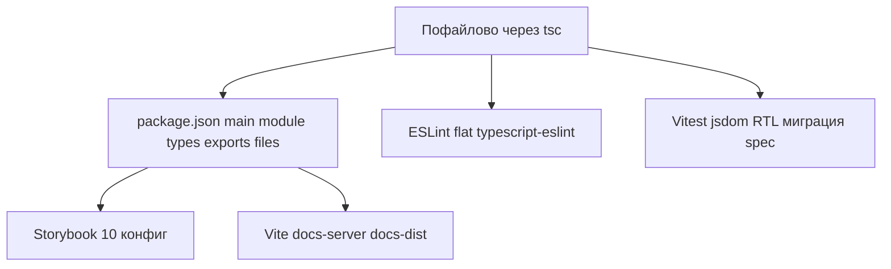

# План реализации фазы 2 ([PLAN.md](../PLAN.md))

Фаза 2 в документе сформулирована как **«современный toolchain (до или параллельно с TS)»**: исходники могут оставаться `.js`, но уже появляются `typescript`, новая сборка, линт и тесты. [Фаза 3](../PLAN.md) — полноценная миграция `src` на `.ts`/`.tsx`.

## Цель: drop-in замена оригинальному react-color

Форк ориентирован на **максимальную совместимость с апстримом** (тот же сценарий использования npm-пакета `react-color`), чтобы потребители могли подставить эту сборку **без смены импортов**.

Практические следствия для toolchain:

- Сохраняем **`main`**, **`module`**, публикацию **полных** каталогов **`lib/`** и **`es/`** в [`files`](../package.json) — как у оригинала после Babel.
- Сборка остаётся **пофайловой** (дерево в `lib`/`es` повторяет `src`), а не одним бандлом на всё — иначе ломаются типичные для таких пакетов **глубокие пути** и отличается содержимое tarball.
- **`exports`** в `package.json` — не обязателен для drop-in; при добавлении проверять старые bundler’ы и deep-imports (см. [AGENTS.md](../AGENTS.md)).
- Публичные имена экспортов из [`src/index.js`](../src/index.js) по-прежнему не менять без major ([AGENTS.md](../AGENTS.md)).

## Исходная точка (что меняем)

| Сейчас | Файлы / артефакты |
|--------|-------------------|
| Babel 6, дублирование CJS/ESM через смену [`.babelrc`](../.babelrc) и [scripts/use-module-babelrc.js](../scripts/use-module-babelrc.js) | `npm run lib` / `npm run es` → `lib/`, `es/` |
| Jest 20 + Enzyme 2 + snapshots | [`src/**/spec.js`](../src/components/chrome/spec.js), `jest` в [package.json](../package.json) |
| ESLint через `@case/eslint-config` | `eslintConfig` в package.json |
| Storybook 3 | [`.storybook/config.js`](../.storybook/config.js), `require.context`, addons |
| Webpack 1 для доков | [webpack.config.js](../webpack.config.js), [scripts/docs-server.js](../scripts/docs-server.js) |

Публичные имена экспортов из [`src/index.js`](../src/index.js) не менять ([AGENTS.md](../AGENTS.md)); артефакты `lib/` и `es/` по-прежнему только из сборки.

---

## Рекомендуемый порядок работ (зависимости)

1. **Сборка + `package.json`** — без этого нельзя стабильно подключить линт/тесты к одному «источнику правды».
2. **ESLint** — можно сразу после появления `tsconfig` (даже если в `src` пока только `.js`).
3. **Vitest** — перенос тестов с сохранением поведения (snapshots + замена Enzyme).
4. **Storybook** и **доки** — часто большие по диффу; логично после зелёной сборки и тестов, либо отдельными PR.

---

## 1. Сборка: убрать Babel 6 и скрипты с `.babelrc`

**Цель:** один конфиг вместо `babel` + `use-module-babelrc` / `restore-original-babelrc`, dual **CJS + ESM**, сохранить семантику ESM-сборки с **lodash-es** (сейчас это делает [scripts/use-module-babelrc.js](../scripts/use-module-babelrc.js)).

**Практический выбор (drop-in):** **`tsc`** — два `tsconfig` (или два прохода): CJS в `lib/`, ESM в `es/`, дерево путей как у `src`, как в оригинале (`babel src -d lib` / `es`). **tsdown** допустим только если в конфиге явно сохраняется **то же дерево файлов** и нет одного общего бандла вместо пакета; **tsup** не использовать (не поддерживается).

**Шаги:**

- Добавить `typescript` (dev), базовый [`tsconfig.json`](../tsconfig.json): для старта достаточно `allowJs: true`, `checkJs: false`, цели модуля под оба выхода — уточнить в соответствии с выбранным способом.
- Настроить вывод в **`lib/`** и **`es/`** с **той же структурой относительных путей**, что у Babel; не переходить на единый `dist/index.js` без решения о breaking release.
- Удалить из `devDependencies` и скриптов: `babel-cli`, пресеты, `babel-plugin-transform-rename-import`, старые `lib`/`es` команды; удалить или заархивировать временные скрипты смены `.babelrc`.
- Прогнать `npm run lib` / `npm run es` (или новые имена, например `build` + `build:es`) и сравнить публичные точки входа.

**Риск:** смена путей в `main`/`module`/`exports` — любые изменения согласовать с полем [`files`](../package.json) и документацией.

---

## 2. Поля `types` и при необходимости `exports`

**Цель фазы 2 по [PLAN.md](../PLAN.md):** поле **types** в [package.json](../package.json).

Пока **src** целиком на JS, варианты (от меньшего к большему объёму работ):

- **Минимальный ручной** [`index.d.ts`](../src/index.d.ts) у корня пакета или рядом с entry, перечисляющий те же именованные экспорты, что [AGENTS.md](../AGENTS.md) — быстро, но требует дисциплины при изменении API.
- **`tsc --emitDeclarationOnly`** с `allowJs` и точечными JSDoc — автоматизация, но настройка может занять время.
- Отложить полноценные декларации до начала фазы 3 — **только если** явно зафиксировать это как сознательное отступление от чеклиста в [PLAN.md](../PLAN.md).

**exports:** для drop-in не обязателен; условные экспорты (`import` / `require` / `types`) можно добавить позже — вводить аккуратно, чтобы не сломать deep-imports и старые резолверы (часто добавляют `exports` + fallback или оставляют только `main`/`module`/`types`).

---

## 3. ESLint: flat config + TypeScript + React Hooks

**Цель:** уйти от встроенного `eslintConfig` + `@case/eslint-config`, если конфиг не поддерживается.

- Добавить `eslint.config.js` (flat), плагины: `@typescript-eslint`, `eslint-plugin-react`, `eslint-plugin-react-hooks` (хуки полезны для примеров и будущего кода).
- Заменить скрипт `eslint src/**/*.js` на актуальный glob или `eslint .` с игнором `lib`, `es`, `node_modules`.
- Сохранить правило про «магические числа» или эквивалент (`no-magic-numbers` сейчас отключён в package.json).

---

## 4. Тесты: Vitest + jsdom + Testing Library

**Цель:** заменить Jest 20 + Enzyme 2 ([пример](../src/components/chrome/spec.js): `react-test-renderer` + `enzyme` `mount`).

- Зависимости: `vitest`, `@vitest/coverage-v8` (по желанию), `jsdom`, `@testing-library/react`, `@testing-library/user-event` (для взаимодействий вместо `simulate`).
- Перенести конфиг из `package.json` `jest` в `vitest.config.*`; сохранить `testRegex` / паттерн для `**/spec.js` или переименовать в `*.spec.jsx` по мере готовности ([PLAN.md](../PLAN.md) допускает постепенно).
- **Snapshots:** Vitest совместим с подходом `toMatchSnapshot`; переснять снапшоты при необходимости одним проходом.
- **Enzyme:** заменить сценарии с `mount`/`find` на RTL (`render`, `screen`, `userEvent`) — по файлам, чтобы не блокировать переход всем объёмом сразу.

Обновить скрипт `test` в package.json: `vitest run` + `eslint`.

---

## 5. Storybook: обновление до 10.x

**Цель:** новый формат конфигурации вместо [`.storybook/config.js`](../.storybook/config.js) (`configure`, `require.context`, старые addons).

- **Важно:** Storybook 10 обычно ожидает **современный React в dev** (часто 18+). Сейчас в [package.json](../package.json) **React 15** в `devDependencies`. Для **разработки** Storybook/тестов разумно поднять `react`, `react-dom`, `react-test-renderer` в dev до поддерживаемой версии, **не меняя** без отдельного решения `peerDependencies` для библиотеки ([AGENTS.md](../AGENTS.md) — фаза 4 для peer).
- Миграция: `main.ts`/`preview.ts`, `stories` glob, замена **addon-knobs** (deprecated) на **Controls** где возможно; сохранить загрузку `*.story.js` постепенно или переименовать в `.stories.tsx` позже.
- Обновить скрипты `storybook` / `build-storybook` и путь вывода (сейчас [`.out`](../package.json)).

---

## 6. Документация: Vite вместо Webpack 1

**Цель:** убрать [webpack.config.js](../webpack.config.js) и hot-path в [scripts/docs-server.js](../scripts/docs-server.js).

- Создать `vite.config` для приложения в [`docs/`](../docs/) (entry из текущего потока, аналог `./docs/index.js`).
- Переписать `docs-server` на `vite dev` (или вызов CLI из node), `docs-dist` на `vite build` с выводом в ожидаемые пути ([`payload.builds`](../package.json) ссылается на `docs/build/bundle.js` — пути нужно согласовать).
- Удалить зависимости Webpack 1 / старых лоадеров из devDependencies после миграции.

---

## 7. Чистка и документация процесса

- Обновить [AGENTS.md](../AGENTS.md) и [README.md](../README.md): новые команды (`build`, `test`, `lint`, storybook, docs).
- При смене артефактов — одна строка в CHANGELOG (если принят в проекте).

---

## Риски и как их снять

| Риск | Митигация |
|------|-----------|
| Разный резолв `lodash` / `lodash-es` между CJS и ESM | Явные alias/externals в конфиге сборки; прогон обоих форматов |
| Большой PR | Разбить: сборка → тесты → линт → storybook → docs; после каждого шага зелёный `test` |
| Storybook vs React 15 | Поднять dev React для инструментов; peer оставить до фазы 4 по плану |
| Поле `types` без полной TS-миграции | Ручной тонкий `d.ts` или отложить с фиксацией в плане |
| Бандлер собрал один файл вместо дерева | Ломает drop-in и глубокие импорты — использовать пофайловый emit |
| Поле `exports` без проверок | Может сломать старые tooling — сначала `types` у entry, `exports` осознанно |

---

## Связь с фазой 3

После фазы 2 репозиторий готов к [фазе 3](../PLAN.md): переименование файлов в `src`, постепенное включение строгости TypeScript, замена PropTypes типами — без блокирующей зависимости от Babel 6.

---

## Todo

- [x] **build-dual-emit** — Пофайловая сборка lib/ и es/ через tsc (два tsconfig), lodash/lodash-es как сейчас; убрать Babel 6 и scripts/use-module-babelrc
- [x] **pkg-types-exports** — Обновить package.json: scripts, main/module/files, types; exports — только если не ломает drop-in
- [x] **eslint-flat** — Перейти на ESLint flat + @typescript-eslint + react-hooks; обновить npm run eslint
- [x] **vitest-rtl** — Заменить Jest+Enzyme на Vitest+jsdom+Testing Library; мигрировать spec.js и снапшоты
- [x] **storybook-10** — Обновить Storybook до 10.x, новый main/preview; поднять dev React при необходимости
- [ ] **docs-vite** — Перевести docs на Vite (dev + build), синхронизировать пути с payload/docs-dist
- [ ] **docs-agents** — Обновить AGENTS.md/README с новыми командами и артефактами сборки
