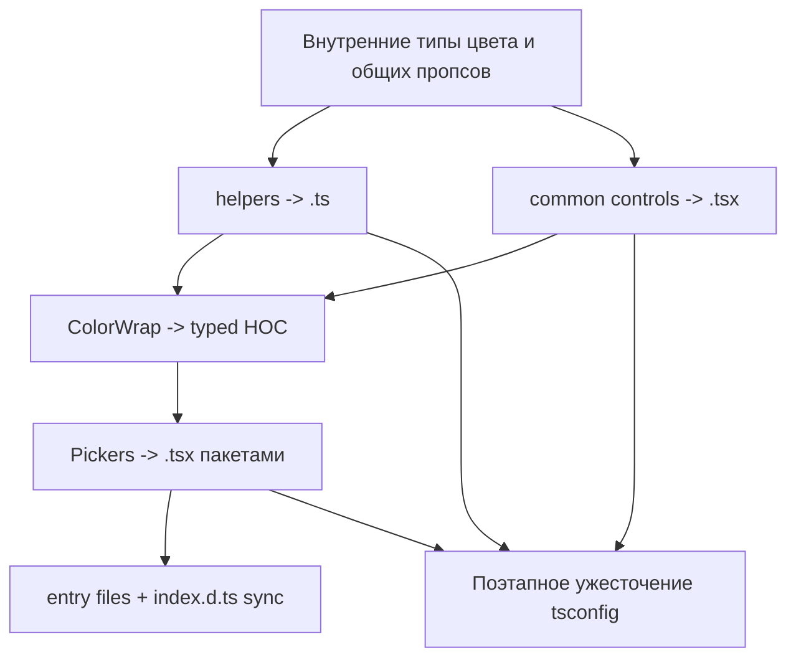

# План реализации фазы 3 ([PLAN.md](../PLAN.md))

Фаза 3 в [`PLAN.md`](../PLAN.md) начинается после завершения toolchain-миграции: сборка `lib/` и `es`, Vitest, ESLint flat config, Storybook и docs уже переведены на современный стек, а библиотечный код в [`src/`](../src/) всё ещё в основном остаётся на JavaScript. Задача этой фазы — поэтапно перевести `src` на `.ts`/`.tsx`, не ломая drop-in совместимость с апстримом и не меняя публичный API пакета.

## Цель: перевести код на TS без breaking changes

Фаза 3 не должна менять способ потребления пакета:

- Сохраняются `main`, `module`, `types` и публикация полного дерева `lib/` и `es` из [`package.json`](../package.json).
- Сохраняются default export и все именованные экспорты из [`src/index.js`](../src/index.js), перечисленные в [`AGENTS.md`](../AGENTS.md).
- Сохраняется текущее runtime-поведение компонентов, включая `propTypes`, `defaultProps`, debounce-поведение [`ColorWrap`](../src/components/common/ColorWrap.js) и существующие callback-сигнатуры.
- Миграция делится на небольшие шаги, чтобы после каждого этапа можно было держать зелёные `test`, `eslint` и `build`.

Практически это означает: типы должны описывать уже существующий контракт, а не навязывать новый API ради удобства TypeScript.

## Исходная точка

| Область | Текущее состояние |
|--------|-------------------|
| Сборка | `tsc` уже собирает JS из [`src`](../src/) в `lib/` и `es` через [`tsconfig.lib.json`](../tsconfig.lib.json) и [`tsconfig.es.json`](../tsconfig.es.json) |
| TS-конфиг | В [`tsconfig.json`](../tsconfig.json) включены `allowJs: true`, `checkJs: false`, `declaration: false`, `rootDir: ./src` |
| Публичные типы | Корневой [`index.d.ts`](../index.d.ts) уже описывает базовый API (`Color`, `ColorResult`, `ColorPickerProps`, `CustomPicker`) |
| Код | Helper-ы, entry wrappers и все компоненты в `src/components/**` ещё на JS/JSX |
| Тесты | Vitest и RTL уже есть, поэтому можно мигрировать блоками с проверкой поведения |

Это хорошая стартовая точка: инфраструктура уже не мешает миграции, а существующий `index.d.ts` можно использовать как черновой публичный контракт.

---

## Рекомендуемый порядок работ

1. Сначала выровнять внутреннюю модель типов и helper-ы, потому что на них опираются почти все picker-компоненты.
2. Затем перевести общие controls в `src/components/common`, чтобы стабилизировать low-level props и обработчики.
3. После этого типизировать `ColorWrap` как HOC, потому что он определяет внешний контракт большинства picker-ов.
4. Только потом мигрировать сами picker-компоненты пакетами, а не всем объёмом сразу.
5. В финале синхронизировать корневые entry points и [`index.d.ts`](../index.d.ts), чтобы публичные типы отражали реальный код.

---

## 1. Внутренний слой типов

**Цель:** перестать дублировать форму цвета и callback-контракты по файлам и сделать один источник правды внутри `src`.

### Что добавить

- Создать внутренний модуль типов в `src`, например `src/types.ts` или `src/types/color.ts`, с описанием:
  - `Color`
  - `RGBColor`, `RGBAColor`
  - `HSLColor`, `HSLAColor`
  - `HSVColor`, `HSVAColor`
  - `ColorResult`
  - общего типа для пользовательских событий коллбеков (`unknown` на публичной границе, конкретнее внутри controls по мере возможности)
- Добавить базовые типы публичных пропсов:
  - `ColorPickerProps`
  - типы для `onChange`, `onChangeComplete`, `onSwatchHover`
  - общий тип `styles` как расширяемый словарь, без попытки жёстко типизировать весь `reactcss` на старте
- Добавить типы для low-level controls:
  - `Alpha`, `Hue`, `Saturation`
  - `EditableInput`
  - `Swatch`, `Checkboard`, `Raised`

### Правила

- На первом проходе не делать типы слишком «умными», если это приведёт к множеству ложных ограничений.
- При расхождении между существующим runtime API и желаемой «идеальной» типизацией побеждает текущий runtime API.
- Корневой [`index.d.ts`](../index.d.ts) остаётся публичным контрактом до тех пор, пока типы из `src` не начнут покрывать весь entrypoint без ручных дубликатов.

---

## 2. Helper-ы: первый миграционный блок

**Цель:** перевести базовую логику цвета и вычислений на TS, чтобы на неё можно было безопасно опираться в компонентах.

### Файлы первого блока

- [`src/helpers/color.js`](../src/helpers/color.js)
- [`src/helpers/alpha.js`](../src/helpers/alpha.js)
- [`src/helpers/hue.js`](../src/helpers/hue.js)
- [`src/helpers/saturation.js`](../src/helpers/saturation.js)
- [`src/helpers/checkboard.js`](../src/helpers/checkboard.js)
- [`src/helpers/interaction.js`](../src/helpers/interaction.js)
- [`src/helpers/index.js`](../src/helpers/index.js)

### Что фиксируем в типах

- `simpleCheckForValidColor` должен возвращать либо валидный частичный объект цвета, либо `false`, как и сейчас.
- `toState` должен возвращать полноценный `ColorResult` c `hex`, `rgb`, `hsl`, `hsv`, `oldHue`, `source`.
- Специальные случаи остаются без изменения:
  - `transparent`
  - сохранение `oldHue` для achromatic цветов
  - permissive-поведение для строк и partial color objects
- Interaction/helper-функции должны принимать DOM-события и координаты достаточно широко, чтобы не ломать существующие controls.

### Ограничения

- Не переписывать алгоритмы «заодно» ради более красивых типов.
- Если для `tinycolor2` или `reactcss` не хватает пригодных типов, добавить локальный `.d.ts`, а не разворачивать отдельный рефакторинг.

---

## 3. Общие компоненты `src/components/common`

**Цель:** типизировать строительные блоки всех picker-ов до перехода к самим picker-компонентам.

### Порядок внутри блока

1. [`src/components/common/Checkboard.js`](../src/components/common/Checkboard.js)
2. [`src/components/common/Raised.js`](../src/components/common/Raised.js)
3. [`src/components/common/Swatch.js`](../src/components/common/Swatch.js)
4. [`src/components/common/EditableInput.js`](../src/components/common/EditableInput.js)
5. [`src/components/common/Alpha.js`](../src/components/common/Alpha.js)
6. [`src/components/common/Hue.js`](../src/components/common/Hue.js)
7. [`src/components/common/Saturation.js`](../src/components/common/Saturation.js)
8. [`src/components/common/index.js`](../src/components/common/index.js)

[`src/components/common/ColorWrap.js`](../src/components/common/ColorWrap.js) вынести в отдельный шаг, потому что это HOC и он задаёт контракт для большинства экспортируемых picker-ов.

### Что важно типизировать

- `EditableInput`:
  - `label`, `value`, `placeholder`, `arrowOffset`, `dragLabel`, `dragMax`, `style`, `hideLabel`, `onChange`
  - keyboard/mouse interactions, включая `movementX`, `keyCode` и значение с `%`
- `Alpha`, `Hue`, `Saturation`:
  - props для текущего состояния цвета
  - стиль-объекты из `reactcss`
  - callbacks с данными цвета
- `Swatch` и `Checkboard`:
  - цвет/hex, hover/click callbacks, размеры и стили

### Политика по runtime-API

- Сохранять `propTypes` и `defaultProps` в этом блоке.
- Не переходить на hooks и не переводить классовые компоненты в функции в рамках фазы 3, если это не требуется для типизации.

---

## 4. `ColorWrap` как typed HOC

**Цель:** перенести в TS ключевой HOC, который превращает внутренний picker-компонент в публичный export с общим поведением.

### Что должен описывать тип

- Входной компонент принимает:
  - собственные props picker-а
  - инъецируемые данные состояния цвета (`hex`, `rgb`, `hsl`, `hsv`, `oldHue`, `source`)
  - `onChange`
  - при необходимости `onSwatchHover`
- Возвращаемый компонент принимает:
  - обычные `ColorPickerProps`
  - picker-specific props
- `getDerivedStateFromProps`, `handleChange`, `handleSwatchHover` и debounce `onChangeComplete` остаются поведенчески идентичными текущей реализации.

### Решение по типам

- Использовать generic `ColorWrap<PickerProps>` или эквивалентную форму, чтобы не дублировать типы для каждого picker-а.
- Не пытаться типизировать инъекцию настолько узко, чтобы ломались существующие дополнительные props у конкретных picker-ов.
- Сохранить текущее значение `defaultProps.color`, потому что оно влияет на начальное состояние wrapped-компонентов.

---

## 5. Picker-компоненты: миграция пакетами

**Цель:** уменьшить размер PR-ов и не блокировать всю фазу одной огромной конвертацией.

### Пакет 1: простые/малые picker-ы

- `alpha`
- `hue`
- `block`
- `circle`
- `material`
- `twitter`

Критерий: минимальное количество вспомогательных подкомпонентов и ограниченный набор пропсов.

### Пакет 2: средняя сложность

- `compact`
- `github`
- `google`

Критерий: несколько подкомпонентов и более развитая конфигурация, но без самых сложных связок полей/превью.

### Пакет 3: наиболее связанные picker-ы

- `chrome`
- `photoshop`
- `sketch`
- `slider`
- `swatches`

Критерий: несколько внутренних подкомпонентов, сложные поля, presets/previews, большее число пользовательских пропсов.

### Для каждого пакета

- Конвертировать компонент и его внутренние подкомпоненты в `.tsx`.
- Переносить `story.js` и `spec.jsx` только вместе с соответствующим компонентом, а не отдельной волной.
- Сохранять `className`-строки, default props, preset-массивы, имена CSS-классов и callback-поведение.

---

## 6. Entry points и синхронизация публичных деклараций

**Цель:** после миграции компонентов привести внешние точки входа и root types к одному источнику правды.

### Что входит в этап

- Перевести entry wrappers:
  - [`src/Alpha.js`](../src/Alpha.js)
  - [`src/Block.js`](../src/Block.js)
  - [`src/Chrome.js`](../src/Chrome.js)
  - и остальные корневые файлы-реэкспорты
- Перевести [`src/index.js`](../src/index.js) в TS-совместимый entrypoint без изменения набора экспортов.
- Синхронизировать [`index.d.ts`](../index.d.ts):
  - либо оставить ручной файл, но обновить типы под фактические TS-источники
  - либо заменить его на thin re-export/генерируемый entry, если сборочный пайплайн уже это позволяет без ломки package layout

### Критерий готовности

- Именованные и default exports совпадают по именам и типам с текущим npm API.
- Публичные callback-и типизируются из реального исходного кода, а не из отдельно живущего вручную поддерживаемого описания.

---

## 7. Стратегия строгости TypeScript

**Цель:** повысить ценность TS без одного огромного PR с тысячами ошибок.

### Стартовое состояние

- Оставить `allowJs: true`, чтобы поддерживать смешанное состояние JS/TS.
- `checkJs` на старте оставить `false`, так как основная польза в этой фазе приходит от реальной конвертации файлов.

### Порядок ужесточения

1. После миграции helper-ов и `common` включить `noImplicitAny`, если объём исправлений остаётся локальным.
2. После стабилизации `ColorWrap` и хотя бы первых пакетов picker-ов включить `strictNullChecks`.
3. Полный `strict` и дополнительные флаги (`exactOptionalPropertyTypes` и др.) рассматривать только после завершения всей миграции `src`.

### Почему так

- Фаза 3 должна двигать код к TS, а не захлебнуться в массовой чистке старых API и permissive edge cases.
- У библиотеки есть много исторически мягких входов (`Color` как строка или object, permissive styles/callbacks), и слишком жёсткие флаги в начале создадут шум вместо реальной пользы.

---

## 8. Политика по PropTypes

**Решение для этой фазы:** не удалять `propTypes`.

Причины:

- В библиотеке это часть текущего runtime-контракта и полезный guard для JS-потребителей.
- Удаление `propTypes` не требуется для перехода на TS.
- Это отдельное решение с отдельным риском по совместимости и размеру бандла.

Значит, в рамках фазы 3:

- TS-типы добавляются **в дополнение** к `propTypes`
- удаление `propTypes` можно вынести в отдельный follow-up после стабилизации типов и оценки влияния на bundle/runtime DX

---

## 9. Тесты и критерии приёмки

### Обязательные проверки после каждого блока

- `npm run test:unit`
- `npm run eslint`
- `npm run build`

### Smoke-проверки публичного API

- default import `react-color`
- именованные импорты picker-ов
- именованные импорты low-level exports (`CustomPicker`, `EditableInput`, `Saturation`, `Swatch` и т.д.)
- типы `onChange`, `onChangeComplete`, `onSwatchHover`
- shape `ColorResult`

### Регрессионные сценарии

- `transparent` и прозрачный black case
- сохранение `oldHue` для ахроматических цветов
- keyboard/mouse interactions в `EditableInput`
- drag/move handlers для `Alpha`, `Hue`, `Saturation`
- hover/click callbacks в swatch/preset сценариях
- picker-specific defaults (`width`, `disableAlpha`, `presetColors` и аналогичные props)

---

## Риски и митигации

| Риск | Митигация |
|------|-----------|
| Один огромный миграционный PR | Делить по блокам: helpers -> common -> ColorWrap -> picker packages |
| Типы начнут расходиться с текущим runtime API | Считать runtime поведение источником истины, а не «идеальную» модель |
| `reactcss` / старые зависимости затрудняют TS | Добавлять локальные `.d.ts`, не расширяя задачу до инфраструктурного рефакторинга |
| Случайно сломаются deep imports или entry exports | Не менять package layout и проверять сборку `lib`/`es` после каждого крупного этапа |
| Преждевременный строгий tsconfig заблокирует миграцию | Включать флаги строгости только после стабилизации блоков |
| Удаление PropTypes вызовет побочные эффекты для JS-потребителей | Не делать это в фазе 3 |

---

## Связь с фазой 4

После этой фазы кодовая база библиотеки уже находится на TypeScript, и фазу 4 можно фокусировать на зависимостях и legacy:

- peer/dev React
- зачистка старых devDependencies
- CI и поддерживающая инфраструктура
- возможные follow-up задачи по `propTypes`, lodash-утилитам и дополнительной строгости

---

## Todo

- [x] **types-foundation** — Создать внутренний слой типов цвета и общих пропсов picker-компонентов в `src`
- [x] **helpers-ts** — Перевести `src/helpers` на `.ts` и зафиксировать типы преобразований цвета и interaction-хелперов
- [ ] **common-ts** — Перевести `src/components/common` на `.ts/.tsx`, кроме `ColorWrap`, и типизировать low-level control props
- [ ] **colorwrap-ts** — Перевести `ColorWrap` в typed HOC без изменения debounce/defaultProps/runtime API
- [ ] **pickers-ts** — Перевести picker-компоненты пакетами, сохраняя публичные пропсы и поведение
- [ ] **entry-types-sync** — Синхронизировать `src` entrypoints и `index.d.ts` с реальными TS-типами после миграции
